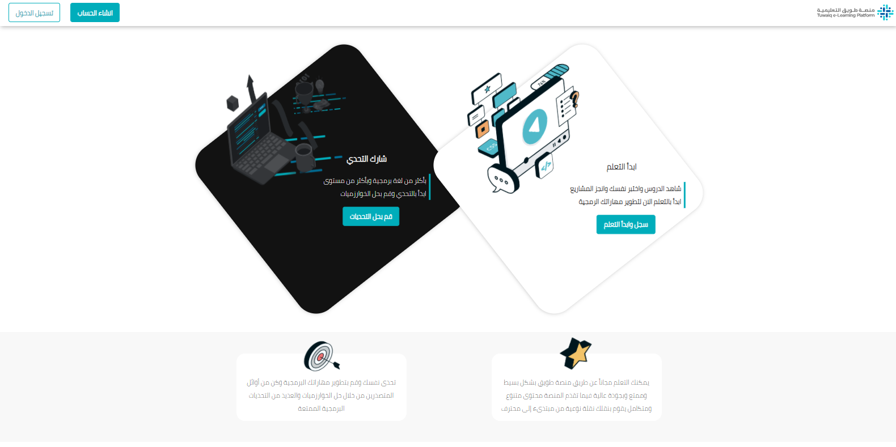

# Lab-week12_day03_frontend_responsiveDesign

فكرة المشروع

بناء مشروع Front-End بناء على تصميم سيتم إعطائك، ويطبق مفاهيم Responsive Design 
تطبيق المشروع يكون على مجموعات مكونه من ٣ اشخاص
- <a href="https://xd.adobe.com/view/b644f3be-ce10-42ac-9b9c-fc7c19914081-e317/specs/">Design Prototype (Desktop)</a>
- <a href="https://xd.adobe.com/view/b644f3be-ce10-42ac-9b9c-fc7c19914081-e317/screen/f4ce35b8-df59-445f-bf24-26dbefb97312/">Design Prototype (Mobile)</a>

## [▷ Live on Netlify](https://tuwaiq.netlify.app/)

## Demo

## Developers

> Batool Alghamdi ➝ [@batool-alghamdi](https://github.com/batool-alghamdi)

> Abdullah AL Haif ➝ [@Abdullah-ALHaif](https://github.com/Abdullah-ALHaif)

> Younes Alturkey ➝ [@younes-alturkey](https://github.com/younes-alturkey)

